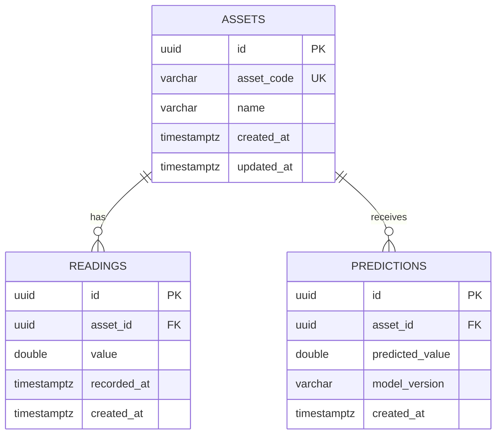

# ERD v0
## Purpose

ERD ini mendefinisikan rancangan relasional awal untuk menyimpan asset,
sensor reading, dan prediction.

tabel `assets` sudah direpresentasikan oleh `AssetModel` dan dapat
diakses melalui `PostgresAssetRepository`. Tabel readings dan predictions masih menjadi rancangan untuk tahap berikutnya. Versioned migration dibuat menggunakan Alembic.

## Diagram

## Relationships

- Satu asset dapat mempunyai nol atau banyak readings.
- Setiap reading harus dimiliki tepat oleh satu asset.
- Satu asset dapat mempunyai nol atau banyak predictions.
- Setiap prediction harus dimiliki tepat oleh satu asset.
- `readings.asset_id` mereferensikan `assets.id`.
- `predictions.asset_id` mereferensikan `assets.id`.

## Constraints

- Semua primary key menggunakan UUID.
- `assets.asset_code` wajib unik dan tidak boleh kosong.
- Foreign key harus mereferensikan asset yang valid.
- Seluruh kolom wajib diisi kecuali kemudian dinyatakan nullable.
- Penghapusan asset yang masih memiliki reading atau prediction direncanakan
  menggunakan `ON DELETE RESTRICT`.
- Nilai reading dan prediction disimpan sebagai double precision.

## Planned indexes

- Unique index pada `assets.asset_code`.
- Index pada `readings(asset_id, recorded_at)`.
- Index pada `predictions(asset_id, created_at)`.

## API alignment note

Domain asset menggunakan dua identifier berbeda:

- `assets.id` adalah UUID internal dan menjadi target foreign key.
- `assets.asset_code` adalah identifier bisnis yang dibaca manusia.

Endpoint prediction saat ini menggunakan field string bernama `asset_id`,
misalnya `A-01`. Sebelum persistence diterapkan, kontrak tersebut perlu
dinormalisasi agar menggunakan UUID internal atau mengganti nama field menjadi
`asset_code`.

